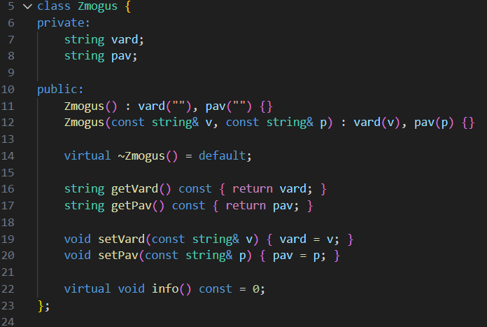
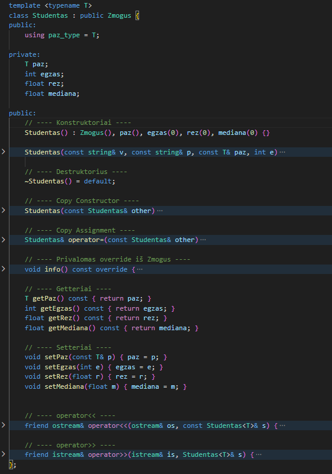

## Programos diegimo ir naudojimo instrukcija ##
 - Atsisiųskite failą `ManoPrograma.exe`.
 - Jei sistema paprašys leidimo (Windows UAC), spauskite `Yes`.
 - Numatyta diegimo vieta: `C:\Program Files\VU\Kamil-Grigorovič`

**Programos paleidimas**
Iš *darbalaukio*, iš *Start Menu*, tiesiai iš *diegimo aplanko*.

**Šalinimas**
 - Atidarykite *Control Panel*
 - Eikite į *Programs and Features*
 - Suraskite *Studentų valdymo sistema*
 - Spauskite *Uninstal*

# |*Studentų valdymo sistema*| #
| Failas | Tipas | Aprašymas |
|---------|-------|-----------|
| `main.h` | Header | Klasės `Studentas` deklaracija|
| `base.h` | Header | Klasės `Zmogus` deklaracija|
| `functions.cpp` | Source | Funkcijos, kurios įveda, skaito, generuoja ir rūšiuoja studentus |
| `projektas.cpp` | Source | `main()` funkcija – programos valdymo meniu |

## Trumpas aprašymas: ##
Programa skirta studentų duomenų tvarkymui: 
 -  `įvedimui rankiniu būdu,` 
 -  `generavimui,` 
 -  `nuskaitymui iš failų.` 
 -  `galimybė pasirinkti, kokį konteinerio tipą naudoti.`

Kodas skaičiuoja kiekvieno studento **vidurkį** ir **medianą**, rūšiuoja studentus pagal vartotojo pasirinktą kriterijų (**vardą, pavardę arba vidurkį**), padalija juos į dvi grupes (Galima pasirinkti vieną iš trijų rūšiavimo strategijų) – **vargsiukus** ir **galvočius** – ir išsaugo rezultatus į atskirus failus.

Prie programos meniu buvo pridėtas `Rule of Three` taisyklės testavimas, kuris aiškiai ir pilnai pademonstruoja jos veikimą.

## Klasės ##
Šiame projekte realizuotos dvi pagrindinės **OOP struktūros** — bazinė abstrakti klasė `Zmogus` ir iš jos paveldinti klasė `Studentas`.
Struktūra sukurta pagal **gerąsias OOP praktikas**.

Klasė `Zmogus – bazinė abstrakti klasė`

Ji turi:
 - *konstruktorius* ir *destruktorių*
 - *getterius* ir *setterius*
 - grynai *virtualią funkciją* `info()`, todėl `Zmogus` tampa *abstrakčia klase*

Zmogus reprezentuoja bendrus visų asmenų duomenis.
Ji yra sukurta kaip abstrakti klasė, todėl negali būti tiesiogiai kuriami jos objektai — ja naudojamasi tik kaip bazine klase.

Klasė `Studentas` – paveldi iš `Zmogus`

`Studentas` išplečia `Zmogus` klasę ir prideda informaciją, būdingą tik studentams.

Paveldėjimas:
 - paveldi *vardą* ir *pavardę* iš `Zmogus`
 - perrašo *virtualią funkciją info()*

Papildomi studento duomenys:
 - namų darbų pažymiai
 - egzamino balas
 - galutinis rezultatas (vidurkis arba mediana)
 - galutinės mediana

Realizuota:
 - konstruktoriai pagal naują paveldėjimo logiką
 - copy constructor
 - copy assignment operator
 - destruktorius
 - įvesties `(operator>>)` ir išvesties `(operator<<)` operatoriai

`Studentas` klasė pilnai įgyvendintas `„Rule of Three“` principas, užtikrinantys *saugų* ir *teisingą* objektų kopijavimą bei gyvavimo ciklo valdymą. Taip pat įgyvendinti perdengti *įvesties* ir *išvesties* operatoriai, kurie leidžia patogiai dirbti su `Studentas` objektais konsolėje ir failuose.

## Funkcijos: ##
 - **_ivesk()_** – įveda studentą rankiniu būdu.
 - **_generuokStudenta()_** – sugeneruoja atsitiktinį studentą.
 - **_iveskIsFailo()_** – perskaito vieną studentą iš failo.
 - **_skaitytiIsFailo()_** – perskaito visą failą su studentais.
 - **_skaiciuotiMediana()_** – skaičiuoja studento medianą.
 - **_SkaiciaiSuKableliu()_** – formatuoja skaičius su dviem dešimtainėmis.
 - **_rikiuotiIrSukurtGrupe()_** – rūšiuoja studentus pagal vartotojo pasirinktą kriterijų ir padalija į grupes (vargsiukai / galvociai).
 - **_spausdintiIFaila()_** – įrašo rezultatus į failą.
 - **_formatuoti()_** – pagalbinė funkcija lentelės spausdinimui.

## Testavimai: ##
### Konteinerio tipas – _vector_ ###
|Įrašų kiekis | Failo nuskaitymas (s) | Rūšiavimas 1 strategija | Rūšiavimas 2 strategija | Rūšiavimas 3 strategija | Įrašymas į failus (s) | Bendra trukmė (s) |
|-------------|-----------------------|-------------------------|-------------------------|-------------------------|-----------------------|-------------------|
|       1 000	|                     - |                       - |                       - |                       - |                     - |             ≈0.01 |
|      10 000 |                     - |                       - |                       - |                       - |                     - |             ≈0.06 |
|     100 000 |                  0.24 |                    0.19 |                      94 |                    0.18 |                  0.08 |              ≈0.5 |
|   1 000 000 |                  2.31 |                    2.16 |                      –- |                    2.55 |                  0.66 |             ≈5.13 |
|  10 000 000 |                 23.62 |                    34.7 |                      –- |                    31.2 |	                  7.1 |             ≈61.9 |

> **Pastaba:**
> - `Bendras (s)` naudoja sparčiausią rūšiavimo strategiją.
> - `-` žymi labai mažą reikšmę  
> - `--` žymi labai didelę reikšmę

### Konteinerio tipas – _list_ ###
|Įrašų kiekis | Failo nuskaitymas (s) | Rūšiavimas 1 strategija | Rūšiavimas 2 strategija | Rūšiavimas 3 strategija | Įrašymas į failus (s) | Bendra trukmė (s) |
| ----------- | --------------------- | ----------------------- | ----------------------- | ----------------------- | --------------------- | ----------------- |
|       1 000 |                     - |                       - |                       - |                       - |  -                    |            ≈0.05  |
|      10 000 |                     - |                       - |                       - |                       - |                     - |             ≈0.09 |
|     100 000 |                  0.33 |                    0.21 |                    0.09 |                    0.09 |                  0.07 |             ≈0.49 |
|   1 000 000 |                   3.3 |                    2.28 |                    1.06 |                    1.06 |                  0.68 |             ≈5.04 |
|  10 000 000 |                 37.44 |                      -- |                    38.8 |                    38.8 |                   9.8 |            ≈86.04 |

> **Pastaba:**
> - `Bendras (s)` naudoja sparčiausią rūšiavimo strategiją.
> - `-` žymi labai mažą reikšmę  
> - `--` žymi labai didelę reikšmę

### Išvados ###
Naudojant `vector` konteinerį, optimaliausia taikyti rūšiavimui `3 strategiją`. Tuo tarpu `list` konteinerio atveju efektyviausios yra `2` ir `3 strategijos`.

### Kompiliatoriaus optimizavimo analizė (O1, O2, O3) ###
Programai buvo atlikta eksperimentinė spartos analizė naudojant tris skirtingus kompiliatoriaus optimizavimo lygius:
- O1
- O2
- O3

Testavimas buvo atliktas su automatine įvestimi, naudojant 10 000 studentų duomenų failą
|Optimizavimo lygis|	Vykdymo laikas (ms)|
|------|--------|
|O1|	204.497 ms|
|O2|	203.2947 ms|
|O3|	233.5941 ms|

## Palyginimo lentelė (struct ir class) ##
|Įrašų kiekis | struct (vector) | struct (list) | class (vector) | class (list) | 
| ----------- | --------------- | ------------- | -------------- | ------------ | 
|       1 000 |            ≈0.03|         ≈0.03 |          ≈0.01|         ≈0.05|       
|      10 000 |           ≈0.06 |         ≈0.07 |          ≈0.06|          ≈0.09|         
|     100 000 |           ≈0.52 |         ≈0.49 |           ≈0.5|          ≈0.49|              
|   1 000 000 |          ≈4.06  |         ≈4.88 |          ≈5.13|          ≈5.04|                
|  10 000 000 |           ≈59.2 |         ≈85.5 |          ≈61.9|        ≈86.04|   

## Sistemos parametrai: ##

- `CPU:`  Intel Core i5-1135G7 - 4 branduoliai / 8 gijų, 2.4 GHz
- `RAM:`  8 GB
- `SSD:`  500 GB

## Dokumentacija (Doxygen) ##

Projektas turi pilnai sugeneruotą `Doxygen HTML dokumentaciją`, kurioje aprašytos:
 - visos klasės (Zmogus, Studentas)
 - visi metodai
 - visi operatoriai
 - visi templated funkcijų aprašymai
 - programos architektūra ir ryšiai tarp klasių

Doxygen dokumentacija pateikta kataloge: `docs/`

## Unit testai ##

Projektas papildytas `Unit testais`, kurie tikrina svarbiausią logiką:
 - *Copy Constructor* veikimą
 - *Copy Assignment Operator* veikimą
 - *Operator<<* ir *operator>>* veikimą
 - *Medianos* skaičiavimo funkciją
 - Rikiavimo ir grupavimo* funkcijas (tiek su vector, tiek su list konteineriais)

Tam naudotas `Catch2 framework'as`.

Testų failai yra kataloge: `tests/`
